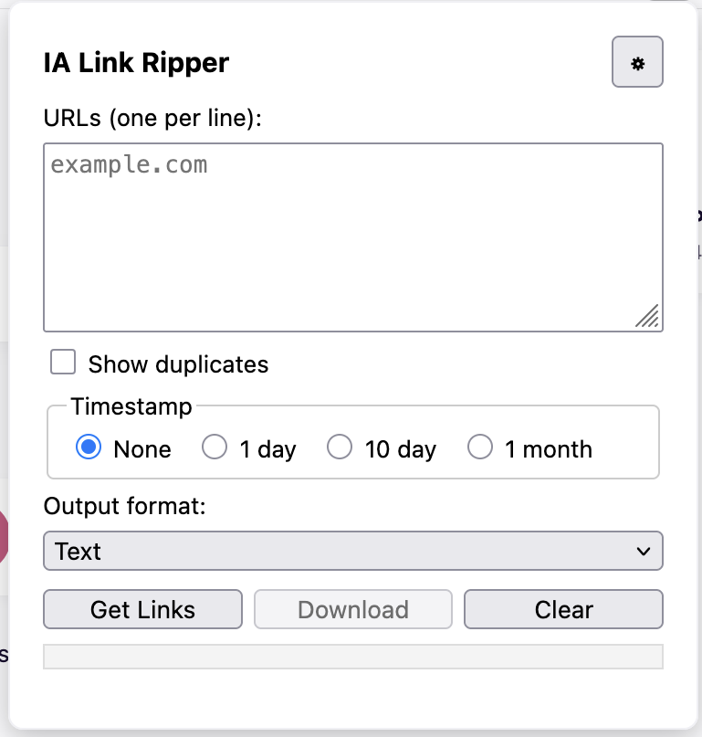

## User Documentation

The Add-Ons run in the Browser. 

### Firefox installation

This software is in development for research. 

It will need to be loaded as a temporary addon:

about:debugging#/runtime/this-firefox

Load with the "Load Temporary Add-On" button. 

### Using Add-On

The plugin will be available in the browser once installed. it may be under the puzzle piece. Click on it to open. 

The screen will allow you to add in URLs and retrieve them. 

These can be downloaded using the download option. By default this is in text but csv and html are possible. The pop-up will load the last retrieved data (if available), or it can be cleared using "clear". 

The pop up will disappear if the page is not kept alive. 